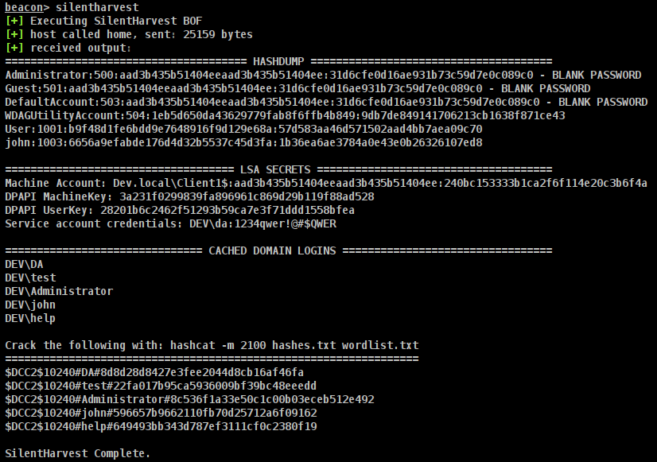
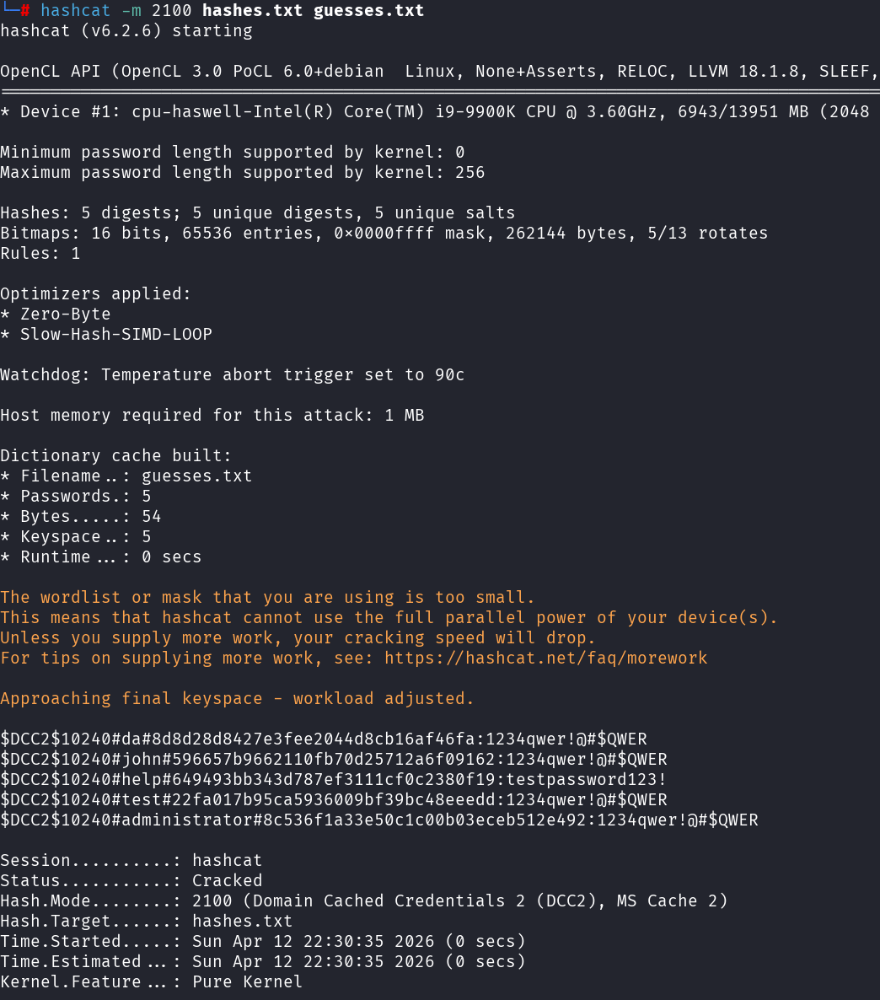
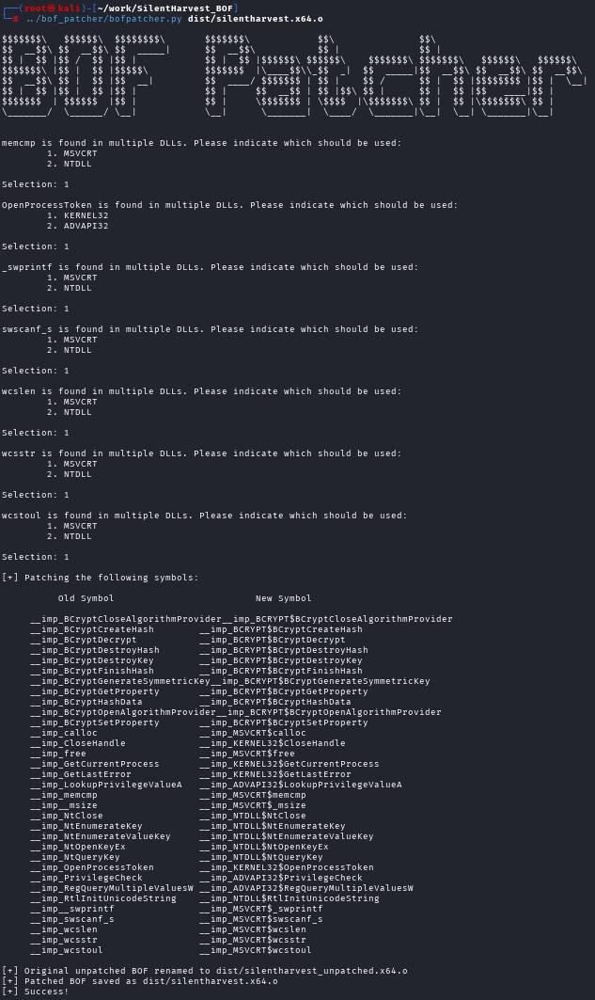

# SilentHarvest BOF
This is a BOF implementation of [Furkan Göksel's](https://x.com/R0h1rr1m) [SilentNimvest](https://github.com/frkngksl/SilentNimvest/tree/main) project, which is in turn based on the [SilentHarvest research](https://sud0ru.ghost.io/silent-harvest-extracting-windows-secrets-under-the-radar/) by [Haidar](https://x.com/haider_kabibo). It's effectively another registry-only credential dumper, replicating hashdump capabilities as well as retrieving secrets stored in the  HKLM\SECURITY\Policy\Secrets subkeys. Old capabilities with a "new" "sneaky" way of delivering.

# Usage

## Decrypt Recovered Cached Domain Credentials
Store the returned hashes in a file and then provide it along with your favorite word list to hashcat

# Compilation
This tool was written without the use of normal BOF API declarations (e.g. a bofdefs.h file). As outlined in this [blog post](https://blog.cybershenanigans.space/posts/writing-bofs-without-dfr/) by [Matt Ehrnschwender](https://x.com/M_alphaaa), it's possible to use objcopy to patch the proper symbols of format `DLL$API` into the BOF post-compilation. The Makefile for this tool calls objcopy, passing an imports_silentharvestXX.txt file containing the proper symbol replacements which then renders the BOF usable. 

I have written a tool called BOFPatcher that automates this process. This allows users to write BOFs as normal C without worrying about cumbersome API declarations:

This tool is available to those who purchase my [BOF Development and Tradecraft](https://training.zeropointsecurity.co.uk/courses/bof-dev-and-tradecraft) course. 

# Credits
1. [Haidar](https://x.com/haider_kabibo) for publishing the original SilentHarvest blog post.
2. [Furkan Göksel's](https://x.com/R0h1rr1m) for his SilentNimvest tool which served as a template when writing this version.
3. The AdaptixC2 team for their [hashdump implementation](https://github.com/Adaptix-Framework/Extension-Kit/blob/main/Creds-BOF/hashdump/hashdump.c) which was referenced and utilized
4. Big shoutout to [Benjamin Delpy](https://x.com/gentilkiwi) for his work on Mimikatz(https://github.com/gentilkiwi/mimikatz). It was my first time going through the source code in any serious capacity, and especially remembering that Claude et al. didn't exist all those years ago its just astoundingly impressive what he put together.
5. [rescatux's chntpw repo.](https://github.com/rescatux/chntpw/tree/master)
6. [Journey1's RemoteSamDecrypt repo.](https://github.com/j0urney1/RemoteSamDecrypt/tree/master)